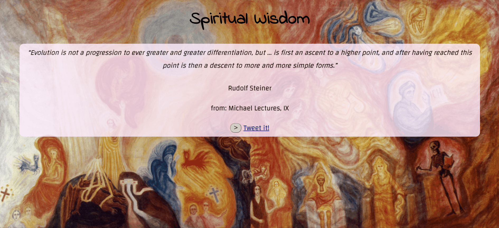

# Random Quote Machine



This is the first project for the freeCodeCamp.org [ Front End Development Libraries](https://www.freecodecamp.org/learn/front-end-development-libraries/#front-end-development-libraries-projects): a random quote generator.

I'm creating this to consolidate and further develop my understanding of React, in addition to enriching my portfolio. 
Doing this in parallel to the [School of Code bootcamp](https://www.schoolofcode.co.uk/).

I always choose to tailor projects to things I like and am interested in - in this case I have created an array of quotes taken from esoteric and spiritual texts, mainly by Rudolf Steiner but also other figures from Christian and non-Christian traditions.

## Technologies
- React
- CSS

## Project diary
- 09/01/2022
  - Wrote and checked the main features. Everything seems to be working as expected. A random quote is generated when loading the app, and upon clicking the ```>``` button, a new random quote is generated and rendered. Will now work on the styling. ✅
  - Styling has been added. Now I'm working on learning how to deploy the app via Heroku.